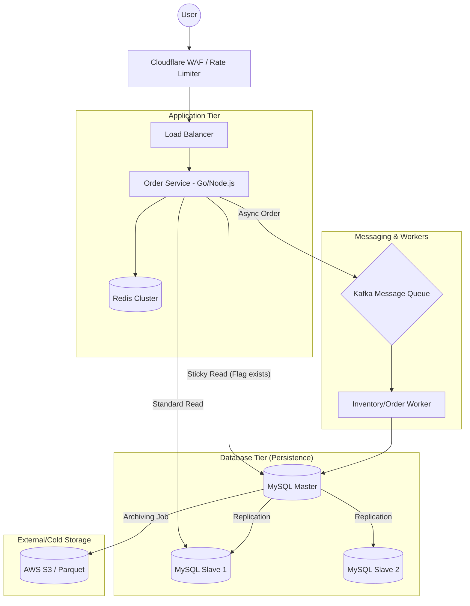

# System Design Document: High-Concurrency Flash Sale Architecture

**Status:** Final Draft  
**Owner:** Senior Software Engineer  
**Date:** March 2026  
**Revision:** 1.0

---

## 1. Executive Summary
This document outlines the architecture for a Flash Sale system designed to handle **1M+ Concurrent Users (CCU)**. The primary goals are to prevent system collapse during traffic spikes, eliminate "over-selling" of inventory, and ensure a seamless user experience despite database replication delays.

---

## 2. System Architecture Diagram


---
## 3. Core Technical Strategies
### 3.1 Inventory & Concurrency Control
To achieve sub-millisecond latency for inventory checks:

Atomic Decrement: Use Redis Lua Scripts to perform DECRBY operations. This ensures the "check-and-reserve" logic is atomic and prevents race conditions.

Backpressure Management: The Inventory Worker consumes from Kafka at a controlled rate, protecting the MySQL Master from connection exhaustion.

### 3.2 Solving Replication Lag (The "Sticky Master Read")
To ensure "Read-Your-Own-Writes" consistency:

Flagging: Upon a successful Write, set a Redis key: sticky_read:{user_id} (TTL: 10s).

Routing Middleware: * If sticky_read:{user_id} exists -> Route to Master DB.

Otherwise -> Route to Slave DB Cluster.

### 3.3 Data Lifecycle & Archiving
Hot Data: Current month partitions in MySQL (SSD).

Warm Data: 1-6 months moved to separate high-capacity HDD instances.

Cold Data: > 6 months exported to S3 in Parquet format for cost-efficient historical analysis.

---

## 4. Reliability & Monitoring
### 4.1 Observability Stack
Metrics: Prometheus tracking mysql_slave_status_seconds_behind_master.

Dashboards: Grafana boards visualizing the correlation between Throughput (Req/s) and DB Lag.

Alerting: Critical alerts via PagerDuty if Replication_Lag > 10s for > 2 minutes.

### 4.2 Failure Fallbacks
Circuit Breaker: Applied to Payment Gateways to prevent thread-pool exhaustion.

Degraded Mode: If Redis fails, the system bypasses immediate checks and queues all requests into Kafka for asynchronous "First-come, first-served" processing, notifying users of a "Processing Delay."

---

## 5. Security & Integrity
Idempotency: Mandatory idempotency_key (UUID) for all order submissions to prevent duplicate transactions.

Bot Mitigation: Challenge-response (CAPTCHA) triggered by the WAF for suspicious IP behavior during the sale start.

---

## 6. Conclusion
By decoupling Order Acceptance from Order Persistence and implementing Intelligent Read Routing, this architecture guarantees high availability and data integrity under extreme load.

---

## 7. Inventory Control and Data Archiving

### 7.1. Redis Lua Script (Atomic Inventory Check)
This script prevents Over-selling. By running this inside Redis, the "check" and "decrement" happen as a single atomic unit, even with millions of concurrent requests.

Lua
```
-- KEYS[1]: The product inventory key (e.g., "product:123:stock")
-- ARGV[1]: The quantity the user wants to buy (usually 1)
local stock = tonumber(redis.call('get', KEYS[1]))

if stock == nil then
    return -1 -- Product does not exist
end

if stock >= tonumber(ARGV[1]) then
    redis.call('decrby', KEYS[1], ARGV[1])
    return 1 -- Success
else
    return 0 -- Out of stock
end
```

### 7.2. MySQL Partitioned Table Schema
This SQL setup allows you to drop old data in milliseconds without locking the database, keeping your Orders table fast and lean.

MySQL
```
CREATE TABLE orders (
    id BIGINT NOT NULL,
    user_id BIGINT NOT NULL,
    product_id BIGINT NOT NULL,
    status VARCHAR(20),
    created_at DATETIME NOT NULL,
    PRIMARY KEY (id, created_at) -- created_at must be part of the PK for partitioning
) 
PARTITION BY RANGE (YEAR(created_at)) (
    PARTITION p2025 VALUES LESS THAN (2026),
    PARTITION p2026_01 VALUES LESS THAN (202602),
    PARTITION p2026_02 VALUES LESS THAN (202603),
    PARTITION p_future VALUES LESS THAN MAXVALUE
);

-- Senior Tip: To archive/delete data from Jan 2026:
-- ALTER TABLE orders DROP PARTITION p2026_01;
```
